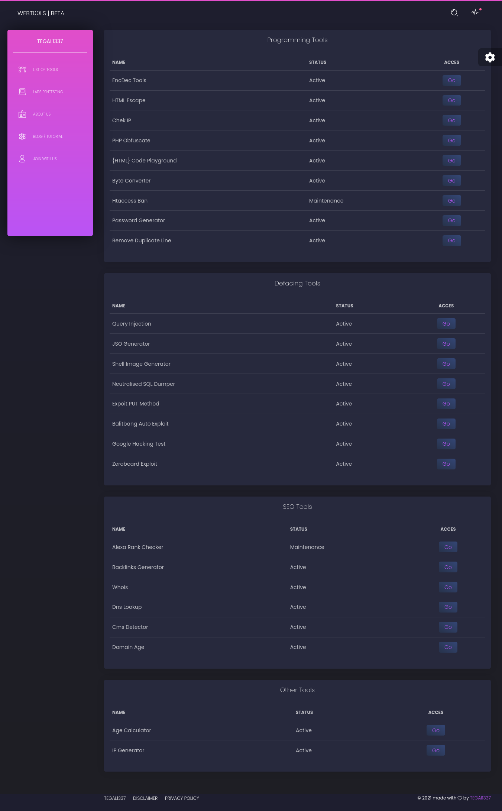

## WebT00ls

An automated tool for all your internet activities based on a website

### List of Tools :

|PROGRAMMING TOOLS|STATUS|
|---|---|
|Encryption Descryption|Active|
|HTML Escape |Active|
|Chek IP |Active|
|PHP Obfuscate |Active|
|{HTML} Code Playground |Active|
|Byte Converter |Active|
|Htaccess Ban |Active|
|Password Generator |Active|
|Remove Duplicate Line |Active|

|EXPLOIT TOOLS|STATUS|
|---|---|
|Query Injection |Active|
|JSO Generator |Active|
|Shell Image Generator |Active|
|Neutralised SQL Dumper |Active|
|Expoit PUT Method |Active|
|Balitbang Auto Exploit |Active|
|Google Hacking Test |Active|
|Zeroboard Exploit |Active|

|SEO TOOLS|STATUS|
|---|---|
|Alexa Rank Checker |Active|
|Backlinks Generator |Active|
|Whois |Active|
|DNS Lookup|Active|
|Cms Detector |Active|
|Domain Age|Active|

|OTHER TOOLS|STATUS|
|---|---|
|Age Calculator |Active|
|IP Generator |Active|

### Screenshot :
.png) 
.png) 
.png) 

### Live access

you can directly access it here [webt00ls](https://tools.tegalsec.org/index/index.php) or download the source code [download](https://github.com/tegal1337/WebT00ls/archive/refs/heads/main.zip)

### More 

Official Website (https://tegalsec.org/) 
Hacking Labs (https://labs.tegalsec.org/) 
Instagram (https://instagram.com/tegalsec/) 

### Support our organization by giving donations

  
